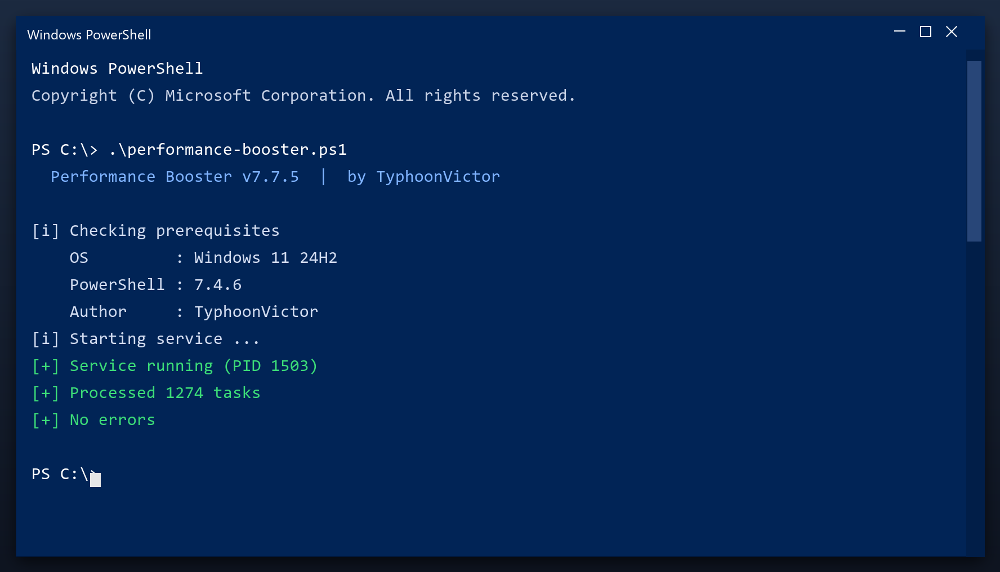

# Performance Booster — Latest Version Free Download (2026)

  

  

Download performance booster for free. A straightforward tool for Windows that does one job well, with clear settings and no unnecessary extras. **100% free. No account needed.**

## Overview

Performance booster is what is often called a PC cleaner. It looks through the places Windows and your programs leave data behind - temp folders, logs, caches - and lets you remove it safely. A backup is made first, so nothing is lost by accident.

| **Term** | **Meaning** |
| --- | --- |
| **Temp folder** | Where programs dump scratch files |
| **Log** | A record file programs write |
| **Backup** | A copy you can restore |
| **Safe to delete** | Not needed by any program |

## The Problem

- **Low free space** - junk files quietly eat your disk
- **Unstable system** - leftover entries cause freezes and errors
- **Manual work** - cleaning by hand takes hours
- **Unsafe downloads** - fake tools are everywhere
- **Confusing options** - most tools are hard to understand

## How It Fixes It

| **Problem** | **Solution** |
| --- | --- |
| **Long boot time** | Trim the startup list |
| **Random crashes** | Fix broken registry links |
| **Full temp folder** | Clear caches in one pass |
| **Slow in games** | Stop background tasks |
| **Unknown files** | See exactly what is safe to remove |

## Install

1. **Get the file** with the button below
2. **Allow** it in Windows SmartScreen (More info, Run anyway)
3. **Open** the tool
4. **Press Start scan** and wait a couple of minutes
5. **Click Clean** to remove what was found

  

> **Note:** this tool changes system settings, so antivirus software may be cautious. Add an exclusion if needed - the build on this page is tested.

## Features

| **Feature** | **Details** |
| --- | --- |
| **Windows** | 11, 10 (64-bit) |
| **Scan time** | 1-3 minutes |
| **Backup** | Automatic before changes |
| **Memory use** | Very low |
| **Price** | Free |
| **Internet** | Not required to run |

## Requirements

| **Component** | **Minimum** | **Recommended** |
| --- | --- | --- |
| **OS** | Windows 10 | Windows 11 (64-bit) |
| **RAM** | 2 GB | 4 GB |
| **Disk** | 100 MB free | 500 MB free |
| **Network** | For download | For updates |

## What's Included

| **Component** | **Details** |
| --- | --- |
| **Executable** | The tool itself |
| **Config** | Defaults already set |
| **Guide** | Plain-language walkthrough |
| **Support** | Issues section in this repo |

## Compared With Alternatives

| **Feature** | **Windows built-in** | **performance booster** |
| --- | --- | --- |
| **Depth** | Basic | Detailed |
| **Categories** | One | Many |
| **Report** | Minimal | Plain-language |
| **Scheduling** | Limited | Built in |

## Tips

- Run the first scan with admin rights for full results
- Let it finish - do not close the window mid-scan
- Check the report before removing anything large
- Schedule a weekly scan if you use the PC daily
- Exclude the tool's own folder from antivirus

## Troubleshooting

| **Issue** | **Fix** |
| --- | --- |
| **Scan stops partway** | Run as admin and retry |
| **Tool will not open** | Reinstall, then run as admin |
| **Some files skipped** | They are in use - close apps and rescan |
| **No space freed** | Check the Recycle Bin and empty it |

## FAQ

**Is performance booster free?**

Yes - the full version, no registration and no hidden payments.

**Is it safe?**

The build is scanned and tested. It creates a restore point before making changes.

**Does it work on Windows 11?**

Yes, and on Windows 10 (64-bit).

**Will it delete my files?**

No. It only removes temporary and leftover files, not your documents or photos.

**Do I need the internet?**

Only to download it. After that it works offline.

**Where do I download it?**

Use the green button in the Quick Start section above.

## Summary

In short: **performance booster** finds the clutter that slows your PC down and removes it safely. No accounts, no telemetry, no ads - just a small tool that works.

- Scans in minutes
- Creates a restore point first
- Works offline
- Free for personal use

**Download it above and run your first scan.**

---

*hollow-lagoon-829 · Updated 2026-10-10 · Shared under the MIT License*
